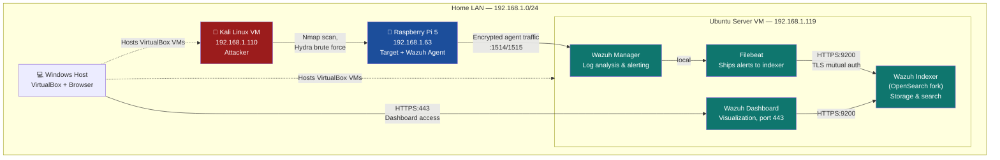

# 🛡️ Home SOC Lab: Wazuh SIEM with Live Attack Simulation

A fully self-built Security Operations Center lab, deployed from scratch across three physical/virtual machines, simulating real-world attacker behavior against a monitored endpoint and verifying detection through a manually-deployed Wazuh SIEM stack — built component-by-component (no all-in-one installer) to develop genuine operational understanding of SIEM architecture.

> Built as hands-on preparation for a SOC L1 Analyst role, and to develop practical skills toward a longer-term Security Architect career path.

---

## 📋 Table of Contents

- [Project Motivation](#-project-motivation)
- [Architecture](#-architecture)
- [Hardware & Software Stack](#-hardware--software-stack)
- [Build Process](#-build-process)
- [Attack Simulations & Detection Results](#-attack-simulations--detection-results)
- [MITRE ATT&CK Coverage](#-mitre-attck-coverage)
- [Troubleshooting & Lessons Learned](#-troubleshooting--lessons-learned)
- [Repository Structure](#-repository-structure)
- [Roadmap](#-roadmap)
- [License](#-license)

---

## 🎯 Project Motivation

I'm a Network Support Engineer working toward a SOC L1 Analyst position, with a longer-term goal of becoming a Security Architect. Rather than just studying SIEM concepts theoretically, I built a complete, working SOC environment at home to:

- Understand Wazuh's internal architecture by installing every component manually (no `wazuh-install.sh` shortcut)
- Practice real attacker TTPs (Tactics, Techniques, and Procedures) and verify they're actually detected
- Build a portfolio artifact that demonstrates depth beyond a single project or certification
- Map every simulated attack to **MITRE ATT&CK** for structured, industry-standard threat documentation

---

## 🏗️ Architecture



**Data flow for a simulated attack:**
1. Kali launches an attack (e.g., Nmap scan, SSH brute force) against the Pi
2. The Pi's local logs (`auth.log`, `sshd`, PAM) record the activity
3. The Wazuh **agent** on the Pi forwards these logs to the **Manager**
4. The Manager's rule engine analyzes and decodes the logs, generating an **alert** with MITRE ATT&CK mapping, compliance tagging (PCI DSS, HIPAA, GDPR, NIST 800-53), and severity scoring
5. **Filebeat** ships the alert to the **Indexer** for storage
6. The **Dashboard** queries the Indexer and renders the alert for analyst review

---

## 🧰 Hardware & Software Stack

| Component | Details |
|---|---|
| **Target** | Raspberry Pi 5 (4GB), Raspberry Pi OS Lite 64-bit (Debian 13 "trixie") |
| **Attacker** | Kali Linux 2026.1, VirtualBox VM, 2GB RAM |
| **SIEM Server** | Ubuntu Server 22.04.5 LTS, VirtualBox VM, 6GB RAM, 48GB disk (LVM) |
| **Hypervisor Host** | MSI Prestige 15, 16GB RAM, Windows |
| **Network Switch** | TP-Link TL-SG608E (managed) |
| **SIEM Platform** | Wazuh 4.14.5 (Manager, Indexer, Dashboard installed independently) |
| **Log Shipper** | Filebeat 7.10.2 (Wazuh module) |
| **Networking** | VirtualBox Bridged Adapter — all hosts on same `192.168.1.0/24` LAN |

---

## 🔨 Build Process

Every component was installed manually via `apt`, not the Wazuh all-in-one installer, specifically to understand the underlying architecture (certificate trust chains, index templates, security plugin internals) rather than treat it as a black box. Full step-by-step documentation:

| Stage | Document |
|---|---|
| 1 | [Hardware & VM Planning](docs/01-architecture.md) |
| 2 | [Wazuh Manager Installation](docs/02-wazuh-manager-install.md) |
| 3 | [Wazuh Indexer Installation & Cert Generation](docs/03-wazuh-indexer-install.md) |
| 4 | [Wazuh Dashboard Installation](docs/04-wazuh-dashboard-install.md) |
| 5 | [Filebeat Configuration](docs/05-filebeat-configuration.md) |
| 6 | [Raspberry Pi Agent Deployment](docs/06-raspberry-pi-agent.md) |
| 7 | [Kali Attacker VM Setup](docs/07-kali-attacker-setup.md) |
| 8 | [Network Troubleshooting Deep-Dive](docs/08-network-troubleshooting.md) |

Reusable install scripts (idempotent, lightly parameterized) are in [`/scripts`](scripts/).

---

## ⚔️ Attack Simulations & Detection Results

| # | Attack | MITRE Technique | Detected? | Write-up |
|---|---|---|---|---|
| 1 | Nmap service/version/OS scan against the Pi | T1595 (Active Scanning) | Reconnaissance phase — baseline, not alert-generating by design | [Details](attack-simulations/01-nmap-reconnaissance/README.md) |
| 2 | Hydra SSH brute-force (6 password attempts) | T1110.001 (Password Guessing), T1021.004 (SSH Lateral Movement) | ✅ Yes — `rule.id 5760` & `5557`, with full MITRE + compliance tagging | [Details](attack-simulations/02-ssh-bruteforce-hydra/README.md) |

Each attack write-up includes the exact command run, raw tool output, the corresponding Wazuh alert (sanitized JSON sample in [`/alert-samples`](alert-samples/)), and an analysis of *why* the detection fired (or didn't).

---

## 🗺️ MITRE ATT&CK Coverage

| Tactic | Technique | Status |
|---|---|---|
| Reconnaissance | T1595 — Active Scanning | ✅ Simulated |
| Credential Access | T1110.001 — Password Guessing | ✅ Simulated & Detected |
| Lateral Movement | T1021.004 — Remote Services (SSH) | ✅ Simulated & Detected |
| Persistence | T1098 / T1547 | 🔲 Planned |
| Defense Evasion | T1070 — Indicator Removal | 🔲 Planned |
| Discovery | T1046 — Network Service Scanning | 🔲 Planned |
| Exfiltration | T1041 | 🔲 Planned |

See [docs/09-mitre-attack-mapping.md](docs/09-mitre-attack-mapping.md) for the full mapping table and reasoning behind technique selection.

---

## 🐛 Troubleshooting & Lessons Learned

This lab generated several genuine real-world troubleshooting scenarios, documented in detail because **the debugging process itself is the most transferable SOC/sysadmin skill**:

- **LVM disk exhaustion mid-install**: Root filesystem hit 100% during `wazuh-indexer` install. Diagnosed and fixed live via `vgs`/`lvs`/`pvs` → `lvextend` → `resize2fs`, recovering 24GB of unallocated volume group space without touching the VM's virtual disk. → [Full writeup](docs/08-network-troubleshooting.md#disk-exhaustion)
- **PMTUD black-holing investigation**: Diagnosed unusually slow package downloads down to a suspected Path MTU Discovery issue (router reporting MTU 1492, consistent with PPPoE overhead) using `ping -M do -s`. Adjusted interface MTU and confirmed via fragmentation testing — though ultimately concluded the dominant cause was transient/router-side QoS throttling of a newly-bridged device, not MTU alone. → [Full writeup](docs/08-network-troubleshooting.md#mtu-investigation)
- **TLS hostname verification mismatch**: Filebeat → Indexer connection failed because the indexer's cert was issued for the LAN IP while Filebeat connected via `127.0.0.1`. Resolved by adjusting `ssl.verification_mode` to certificate-only trust rather than regenerating certs. → [Full writeup](docs/05-filebeat-configuration.md#tls-troubleshooting)
- **VirtualBox bridged-over-Wi-Fi instability**: Documented inconsistent throughput when bridging a VM's virtual NIC over a Wi-Fi adapter vs. the host's actual measured 990Mbps connection, and the practical workaround (temporary NAT switching for bulk downloads).

---

## 📁 Repository Structure

```
wazuh-home-soc-lab/
├── README.md                          ← you are here
├── docs/                               ← step-by-step build documentation
├── attack-simulations/                 ← per-attack write-ups with evidence
│   ├── 01-nmap-reconnaissance/
│   └── 02-ssh-bruteforce-hydra/
├── configs/                             ← sanitized real configs used in this lab
│   ├── wazuh-indexer/opensearch.yml
│   ├── wazuh-dashboard/opensearch_dashboards.yml
│   ├── filebeat/filebeat.yml
│   └── cert-generation/config.yml
├── scripts/                              ← reusable install scripts
├── alert-samples/                        ← real (sanitized) Wazuh alert JSON
└── assets/                                ← diagrams / screenshots
```

---

## 🚀 Roadmap

- [ ] Run an extended Hydra attack to trigger Wazuh's correlation/frequency-based brute-force escalation rule (vs. individual per-attempt alerts)
- [ ] Add Nikto/Gobuster web enumeration against the Pi's Apache instance
- [ ] Write custom Wazuh detection rules beyond the default ruleset
- [ ] Integrate File Integrity Monitoring (FIM) and simulate unauthorized file changes
- [ ] Add a second agent (Windows VM) to test cross-platform detection
- [ ] Build a custom Wazuh dashboard visualization for this lab specifically
- [ ] Threat intel enrichment: cross-reference attacker IP/TTPs against VirusTotal/OTX (even for internal lab IPs, as a workflow exercise)

---

## 📜 License

This repository is documentation and configuration of a personal home lab for educational purposes. Code/scripts are released under the [MIT License](LICENSE). Wazuh itself is licensed separately under GPLv2 — see [wazuh.com](https://wazuh.com).

---

## 🙋 About

Built and documented by Sree — Network Support Engineer (ITOC), MSc Cybersecurity (Distinction), CEH, CompTIA Security+. Currently progressing toward SOC L1 Analyst and Cyber Threat Intelligence roles, with a 5-year target of Security Architect.
