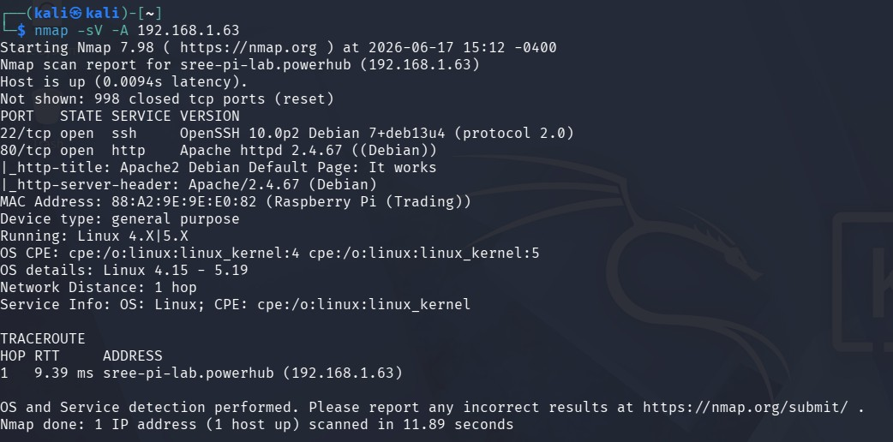

# Attack Simulation 01: Nmap Reconnaissance Scan

| | |
|---|---|
| **MITRE Technique** | [T1595 — Active Scanning](https://attack.mitre.org/techniques/T1595/) |
| **MITRE Tactic** | Reconnaissance |
| **Attacker** | Kali Linux VM (`192.168.1.110`) |
| **Target** | Raspberry Pi (`192.168.1.63`, hostname `sree-pi-lab`) |
| **Detected by Wazuh?** | No (by design — see analysis below) |

## Command

```bash
nmap -sV -A 192.168.1.63
```

| Flag | Purpose |
|---|---|
| `-sV` | Detect service versions on open ports |
| `-A` | Aggressive scan: enables OS detection, version detection, script scanning, and traceroute |

## Output



```
Starting Nmap 7.98 ( https://nmap.org ) at 2026-06-17 14:15 -0400
Nmap scan report for sree-pi-lab.powerhub (192.168.1.63)
Host is up (0.0073s latency).
Not shown: 998 closed tcp ports (reset)
PORT   STATE SERVICE VERSION
22/tcp open  ssh     OpenSSH 10.0p2 Debian 7+deb13u4 (protocol 2.0)
80/tcp open  http    Apache httpd 2.4.67 ((Debian))
|_http-title: Apache2 Debian Default Page: It works
|_http-server-header: Apache/2.4.67 (Debian)
MAC Address: 88:A2:9E:9E:E0:82 (Raspberry Pi (Trading))
Device type: general purpose
Running: Linux 4.X|5.X
OS CPE: cpe:/o:linux:linux_kernel:4 cpe:/o:linux:linux_kernel:5
OS details: Linux 4.15 - 5.19, OpenWrt 21.02 (Linux 5.4)
Network Distance: 1 hop

TRACEROUTE
HOP RTT     ADDRESS
1   7.30 ms sree-pi-lab.powerhub (192.168.1.63)

Nmap done: 1 IP address (1 host up) scanned in 11.59 seconds
```

## Analysis

Two services exposed:
- **SSH (22/tcp)** — OpenSSH 10.0p2. This became the target for [Attack Simulation 02 (Hydra brute force)](../02-ssh-bruteforce-hydra/README.md).
- **HTTP (80/tcp)** — Apache 2.4.67 default install page, nothing custom hosted. A candidate for future web-enumeration exercises (Nikto/Gobuster — see [MITRE roadmap](../../docs/09-mitre-attack-mapping.md)).

## Why this didn't generate a Wazuh alert

This is intentional, not a gap. A single Nmap scan is, on its own, indistinguishable from many legitimate network management/discovery tools, and Wazuh's default ruleset doesn't flag it without additional configuration (e.g. a dedicated port-scan-detection rule watching for many distinct destination ports from one source in a short window). This scan is documented here as the **reconnaissance phase** of a realistic attack chain — the step that *informs* the next, detectable action — rather than as a detection-test in itself.
