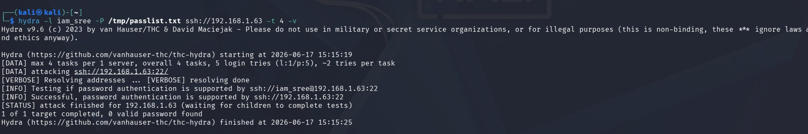
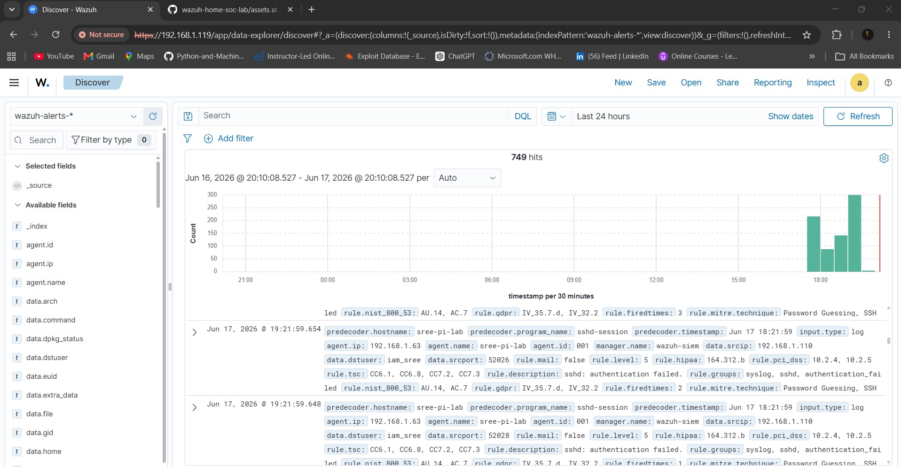

# Attack Simulation 02: SSH Brute Force (Hydra)

| | |
|---|---|
| **MITRE Technique** | [T1110.001 — Brute Force: Password Guessing](https://attack.mitre.org/techniques/T1110/001/), [T1021.004 — Remote Services: SSH](https://attack.mitre.org/techniques/T1021/004/) |
| **MITRE Tactic** | Credential Access, Lateral Movement |
| **Attacker** | Kali Linux VM (`192.168.1.110`) |
| **Target** | Raspberry Pi (`192.168.1.63`, hostname `sree-pi-lab`), user `iam_sree` |
| **Detected by Wazuh?** | ✅ Yes |

## Setup

A small deliberately-wrong password list (no need for a full wordlist like `rockyou.txt` — the goal is repeated *failures*, not a successful guess, for detection-testing purposes):

```bash
echo -e "password\n123456\nadmin\nraspberry\nqwerty\n0123456" > /tmp/passlist.txt
```

## Command

```bash
hydra -l iam_sree -P /tmp/passlist.txt ssh://192.168.1.63 -t 4 -V
```

| Flag | Purpose |
|---|---|
| `-l iam_sree` | Target username |
| `-P /tmp/passlist.txt` | Password wordlist |
| `-t 4` | 4 parallel connection threads |
| `-V` | Verbose — show each attempt live |

## Output



```
Hydra v9.6 (c) 2023 by van Hauser/THC & David Maciejak
Hydra (https://github.com/vanhauser-thc/thc-hydra) starting at 2026-06-17 14:21:55

[DATA] max 4 tasks per 1 server, overall 4 tasks, 6 login tries (l:1/p:6), ~2 tries per task
[DATA] attacking ssh://192.168.1.63:22/
[ATTEMPT] target 192.168.1.63 - login "iam_sree" - pass "password" - 1 of 6 [child 0] (0/0)
[ATTEMPT] target 192.168.1.63 - login "iam_sree" - pass "123456" - 2 of 6 [child 1] (0/0)
[ATTEMPT] target 192.168.1.63 - login "iam_sree" - pass "admin" - 3 of 6 [child 2] (0/0)
[ATTEMPT] target 192.168.1.63 - login "iam_sree" - pass "raspberry" - 4 of 6 [child 3] (0/0)
[ATTEMPT] target 192.168.1.63 - login "iam_sree" - pass "qwerty" - 5 of 6 [child 1] (0/0)
[ATTEMPT] target 192.168.1.63 - login "iam_sree" - pass "0123456" - 6 of 6 [child 3] (0/0)
1 of 1 target completed, 0 valid password found
Hydra (https://github.com/vanhauser-thc/thc-hydra) finished at 2026-06-17 14:22:03
```

All 6 attempts failed as expected — the goal of this test was detection verification, not actual compromise.

## Wazuh Detection Result

Both the SSH daemon and the underlying PAM authentication layer logged the failures **independently**, generating two correlated alert types per attempt:



### Alert 1 — `sshd` authentication failure (rule 5760)
```
rule.id: 5760
rule.description: sshd: authentication failed.
rule.level: 5
rule.groups: syslog, sshd, authentication_failed
rule.mitre.technique: Password Guessing, SSH
rule.mitre.id: T1110.001, T1021.004
rule.mitre.tactic: Credential Access, Lateral Movement
data.srcip: 192.168.1.110
data.dstuser: iam_sree
full_log: sshd-session[35709]: Failed password for iam_sree from 192.168.1.110 port 52026 ssh2
```

### Alert 2 — PAM `unix_chkpwd` failure (rule 5557)
```
rule.id: 5557
rule.description: unix_chkpwd: Password check failed.
rule.level: 5
rule.groups: pam, syslog, authentication_failed
rule.mitre.technique: Password Guessing
rule.mitre.id: T1110.001
rule.mitre.tactic: Credential Access
full_log: unix_chkpwd[35722]: password check failed for user (iam_sree)
```

Full sanitized alert sample (real JSON structure as returned by the Wazuh dashboard, with personal identifiers generalized): [`alert-samples/ssh-bruteforce-alert.json`](../../alert-samples/ssh-bruteforce-alert.json)

## Compliance Framework Auto-Tagging

Notably, Wazuh attached compliance mappings to these alerts automatically, with no custom configuration:

| Framework | Mapping |
|---|---|
| PCI DSS | 10.2.4, 10.2.5 |
| HIPAA | 164.312.b |
| NIST 800-53 | AU.14, AC.7 |
| GDPR | IV_35.7.d, IV_32.2 |
| TSC (SOC 2) | CC6.1, CC6.8, CC7.2, CC7.3 |
| GPG13 | 7.1 / 4.3 |

This is genuinely useful in a real SOC context — it means a single technical alert is simultaneously usable as evidence for multiple compliance audit trails without any extra analyst effort.

## Analysis & Next Step

What fired here are six **individual** authentication-failure alerts (`rule.level: 5` — relatively low severity, "one login failed"). Wazuh maintains a separate, higher-severity **correlation rule** that escalates to something like *"sshd: Multiple authentication failures"* once a frequency threshold of failures from one source is exceeded within a short time window. Six attempts may not be enough to cross that threshold.

**Planned follow-up:** re-run with a longer password list (10-15+ entries) submitted in rapid succession, specifically to trigger the escalated correlation alert and document the difference between "noise" (a single failed login — could be a fat-fingered legitimate user) and "signal" (a detected attack pattern) — a distinction that matters in real SOC alert triage.
