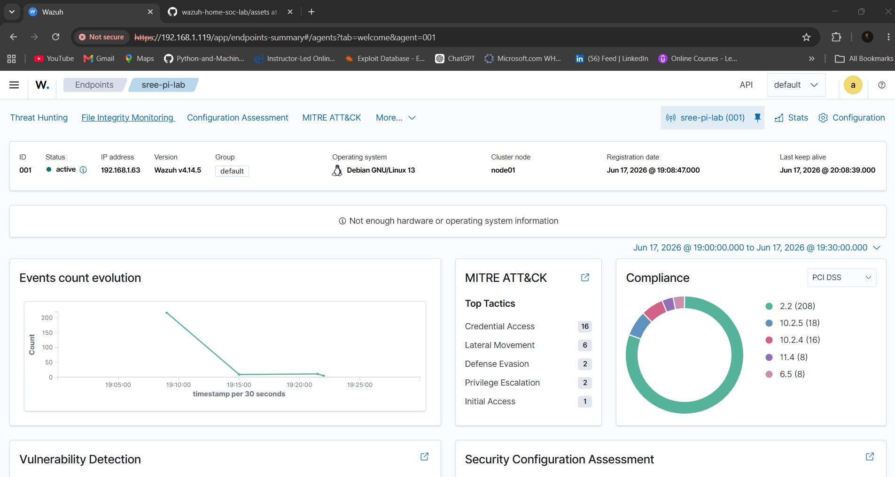

# MITRE ATT&CK Mapping

[MITRE ATT&CK](https://attack.mitre.org/) is a globally-used knowledge base of adversary tactics and techniques, used here to structure attack simulations the same way a real SOC documents detections and threat intelligence.

## Observed Tactic Breakdown (Agent Detail View)

The agent detail page aggregates MITRE tactics across **all** alerts seen for that agent in the selected time window, not just from a single attack run:



In this lab's capture: `Credential Access (16)`, `Lateral Movement (6)`, `Defense Evasion (2)`, `Privilege Escalation (2)`, `Initial Access (1)`. The Credential Access / Lateral Movement counts align directly with the Hydra SSH brute-force test above. The smaller counts under other tactics weren't deliberately triggered by a specific simulation in this session — they're flagged here as an open question rather than an explained result, and are a good candidate to investigate further (e.g. by checking which specific rule IDs fired and what generated them) before claiming a specific cause.

## Techniques Simulated in This Lab

### T1595 — Active Scanning (Reconnaissance)

```bash
nmap -sV -A 192.168.1.63
```

This is deliberately a **reconnaissance-phase** technique — it represents what a real attacker does *before* attempting exploitation, and Wazuh's default ruleset does not (and arguably should not) treat a single Nmap scan as alert-worthy on its own, since the tool itself isn't inherently malicious traffic. It's included here to document the full attacker workflow, not because it triggered a detection.

**Result:** identified two open services on the target — SSH (22/tcp, OpenSSH 10.0p2) and HTTP (80/tcp, Apache 2.4.67 default page) — directly informing the next attack chosen (SSH brute force).

---

### T1110.001 — Brute Force: Password Guessing
### T1021.004 — Remote Services: SSH

```bash
hydra -l iam_sree -P /tmp/passlist.txt ssh://192.168.1.63 -t 4 -V
```

**Result: detected.** Wazuh's default ruleset fired on both the `sshd` authentication failure (rule 5760) and the underlying PAM `unix_chkpwd` failure (rule 5557) for each attempt — two independent log sources corroborating the same event. Wazuh automatically attached both MITRE technique IDs to the alert without any custom rule-writing required:

```
rule.mitre.technique: Password Guessing, SSH
rule.mitre.id: T1110.001, T1021.004
rule.mitre.tactic: Credential Access, Lateral Movement
```

Full sanitized alert sample: [`alert-samples/ssh-bruteforce-alert.json`](../alert-samples/ssh-bruteforce-alert.json)

**A nuance worth noting:** these are *individual* per-attempt alerts at `rule.level: 5` (low severity — "a single login failed"). Wazuh separately maintains frequency/correlation rules that escalate to a much higher-severity alert (e.g. level 10+, *"sshd: Multiple authentication failures"*) once a threshold of failures from the same source within a short time window is exceeded. A 6-attempt test may not cross that threshold — distinguishing "one failed login" from "a detected brute-force pattern" is itself a useful SOC concept to internalize, directly analogous to volume-based detection logic used elsewhere (e.g. MFA fatigue detection, which is based on push notification *volume*, not simple failure counts).

---

## Planned / Roadmap Techniques

| Tactic | Technique | Plan |
|---|---|---|
| Discovery | T1046 — Network Service Scanning | Extend Nmap usage with service enumeration scripts (`--script` NSE) |
| Credential Access | T1110.001 (extended) | Re-run Hydra with a longer wordlist to deliberately cross the frequency-correlation threshold and observe the escalated alert |
| Lateral Movement | T1021.004 (extended) | Attempt actual SSH pivoting post-compromise (with a deliberately weak test credential) to observe session/lateral-movement-specific alerting |
| Persistence | T1098 / T1547 | Simulate a cron job or SSH authorized_keys modification, verify File Integrity Monitoring (FIM) catches it |
| Defense Evasion | T1070 — Indicator Removal | Attempt log clearing/tampering on the Pi, verify Wazuh's own log tampering detection |
| Discovery (web) | T1595.002 | Nikto/Gobuster enumeration against the Pi's Apache instance |
| Exfiltration | T1041 | Simulate outbound data transfer pattern, observe network-layer detection (if any, given current ruleset scope) |

## Why MITRE Mapping Matters Here

Beyond being industry-standard documentation, mapping each simulated attack to MITRE ATT&CK:
- Makes the lab's attack coverage auditable at a glance (which tactics are covered vs. still planned)
- Mirrors how real SOC teams document detections and report coverage gaps to leadership
- Gives concrete, structured talking points for technical interviews — "I simulated T1110.001 and verified detection end-to-end" is a stronger statement than "I tried a brute force attack and it worked"
